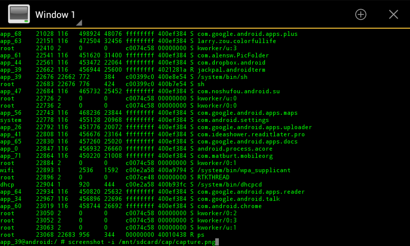

Automating Screenshots
======================

Pre-requisites
--------------

* Terminal application (e.g. https://play.google.com/store/apps/details?id=jackpal.androidterm )

* Rooted Android device with ICS

Howto
-----

Start up a terminal

Issue the "su" command to gain root priviledges

To take a screenshot after 30 seconds and save into the "screencaps" folder on
the SD card, use the following command:

.. code-block:: sh

   sleep 30; screenshot -i /mnt/sdcard/screencaps/capture.png

The ``-i`` argument will cause the application to automatically add a number to
the filename to avoid conflicts.
