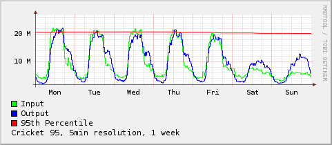
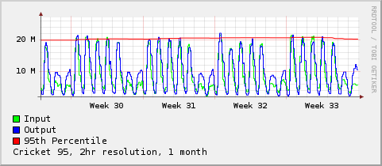

cricket-95
==========

.. note::

   This document was written back in 2003 when cricket was one of the
   better RRD frontends for network monitoring.  These days very few
   people even remember cricket.

   The parts of this page specific to cricket have very little
   relevance these days; however the parts dealing with the maths and
   processing RRD files are still valid.

The Scenario:
-------------

You have a customer who wants to connect via a large pipe and pay
based on their usage. You provide a DS3 to the customer. They use
approx 2Mb/s 8 hours a day, 5 days a week. They use a negligible
amount out of these hours. On the 3rd of the month one of their staff
downloads a large file from the Internet and they burst to 20Mb/s for
5 minutes.

Billing them for peak usage is a good way to make money, but not
exactly fair in this scenario... Better to let them get away with
short bursts and only bill them when they exceed a certain
threshold. The problem then is how to define the threshold...

The 95th percentile is the smallest number bigger than 95% of the
values in a given set. In the standard configuration Cricket
consolidates data too early to generate a statistically valid 95th
percentile. And therein lies the challenge...

The Dirtywork:
--------------

This config fragment defines all the necessary config needed to
collect and graph the data as well as an example of how to build a
target type.  This is based on the file I created for internal use at
my current place of employ to help us monitor the 95th percentile
usage of burstable customer links.

.. literalinclude:: cricket-95.Defaults

The actual :ref:`perl code<p95-code>` that performs the calculations is shown
below. The config file above assumes it's installed in the directory
cricket-config/../contrib. It relies on the CPAN module
``Time::Parsedate`` and the ``RRDs`` perl module from the RRDTool
package. This script has only been tested on Cricket, but could
probably be converted for use with other RRD based front ends pretty
easily.

For more information on the implementation of the calculation, see
:doc:`percentiles`.

The calculations aren't particularly quick, and I'll probably need to
redevelop them at some time in the future, but at the moment they suit
my needs well enough. YMMV.

.. note::

   I did some investigation of different methods of calculating the
   95th percentile of a set using python in 2012, and put the code in
   github:

   https://github.com/xchewtoyx/pct95-bench

You can set up an actual graph using the following code:

.. code::

   target customer001
     router = pe-01.mynetwork.net
     interface-name = Serial1
     long-desc = "E1 Connection to customer"
     short-desc = "E1 Connection to customer %95-preview%"
     target-type = standard-interface-95

Sample Graphs
-------------

Just give me the damn code!
---------------------------

.. _p95-code:

.. literalinclude:: cricket-95.pl
   :language: perl

Billing
-------

First off a warning: Cricket is not a billing platform. Trying to bill
customers by looking at a graph with limited resolution is not only
unprofessional, it's also inaccurate. Please, if you don't understand
and accept the inaccuracies of this system - don't bill your customers
based on it. The script presented here is released under the Gnu
Public License and therefore carries no warranty.

If you must bill using this system then a few words of advice. Make
sure you understand the calculations used, and any potential errors
that may affect the results returned. Consult a lawyer and make sure
your contract clearly states the details to the customer. I would
recommend you run the script outside of Cricket at a defined time
(e.g. midnight on the first of every month), and keep an archive copy
of the RRD file used, so that you have some backup in case of dispute.

And as a last word of advice: Cricket is not a billing platform.
